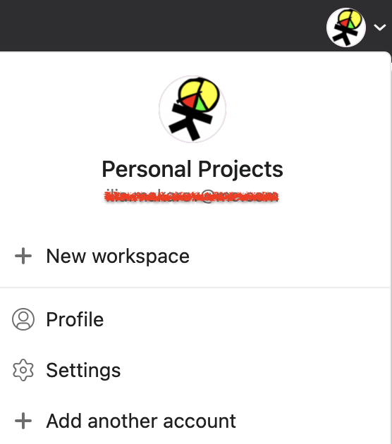

Asana App Setup Instructions
===

To install the Asana app you must first create a __Personal access token__. Head over to your Asana account to get started.

Once you've logged in, click on your avatar at the top right of the screen and choose "My settings..."

Navigate to the Apps tab and click "Manage Developer Apps"

Click "Create new token".

Give the token a name - this can be anything, something like "Deskpro App" will do.

Click "Create token" and copy your personal access token to your clipboard. __Keep this token private, safe and secure__.

When you install the Asana app in Deskpro, enter this token into the settings tab of the app.

To configure who can see and use the Asana app, head to the "Permissions" tab and select those users and/or groups you'd like to have access.

When you're happy, click "Install".
